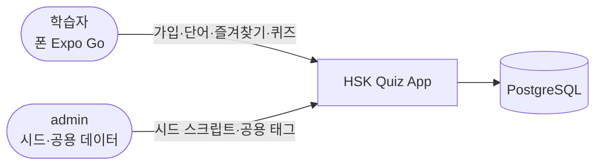
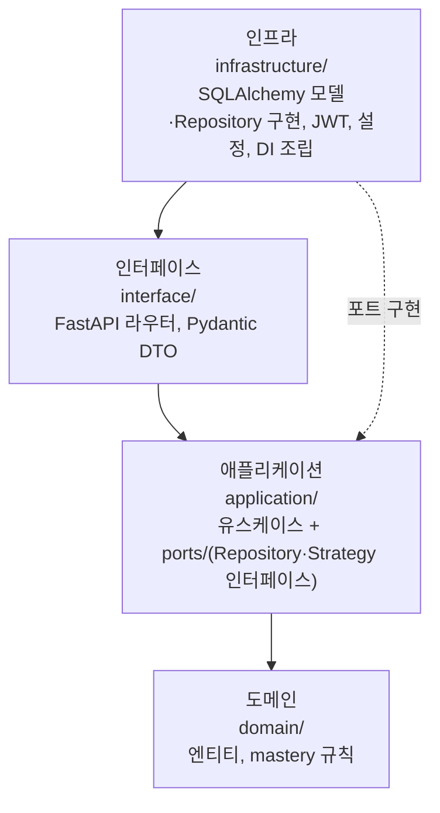
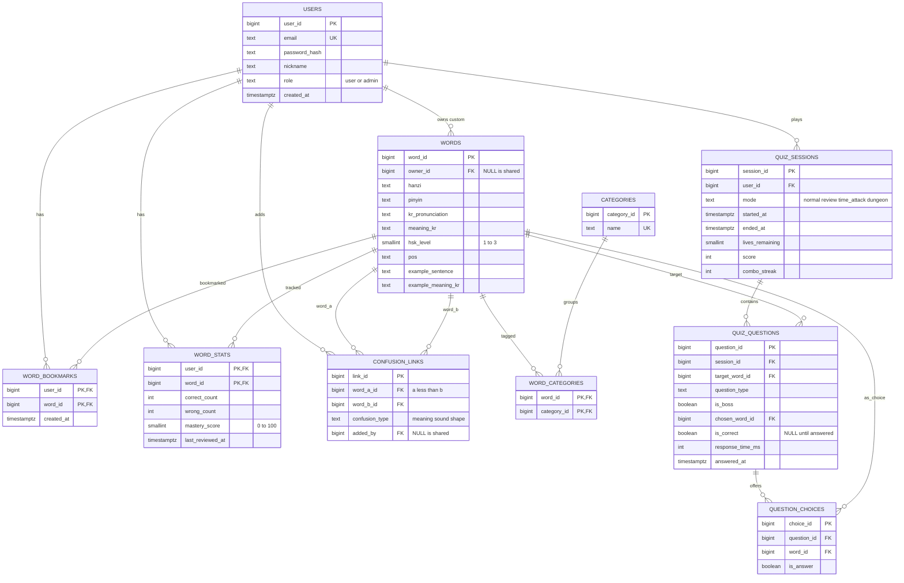

# arc42 — HSK Quiz App (필요한 섹션만)

- 버전: v0 (2026-09-17)
- 포함 섹션: 1 목표 · 3 컨텍스트 · 5 빌딩 블록 · 8 횡단 관심사 · 9 결정 · 11 리스크

## 1. 도입과 목표

### 핵심 기능
혼동 관계와 유저별 숙련도를 써서 **약한 단어를 정답으로, 헷갈리는 단어를 보기로** 출제하는 HSK 1~3급 퀴즈. 자세한 범위는 [PRD](../requirements/PRD.md).

### 품질 목표
| 우선 | 품질 | 구체적 기준 |
|---|---|---|
| 1 | 데이터 분리·보안 | 다른 유저의 리소스에 접근하면 항상 404, 모든 유저 소유 API에 해당 테스트 |
| 2 | 변경 용이성 | 출제 방식·문제 유형을 추가할 때 기존 유스케이스를 고치지 않음(Strategy/Factory 도입 후) |
| 3 | 검증 가능성 | 이슈마다 사용자가 폰·curl로 직접 확인할 방법이 있고, 도메인 규칙은 DB 없이 단위 테스트 |

### 이해관계자
| 역할 | 기대 |
|---|---|
| 사용자(학습자·개발 책임자) | 헷갈리는 단어 위주 연습, DB·아키텍처·보안 학습 |
| Claude Code | 명확한 AC와 규칙([CLAUDE.md](../../CLAUDE.md)) |

## 3. 컨텍스트와 범위

| 외부 요소 | 주고받는 것 |
|---|---|
| 학습자(앱) | HTTPS JSON API, Bearer 토큰 |
| admin | 시드 스크립트(CLI), admin 권한 API |
| HSK 단어 데이터 출처 | 시드 파일(출처·라이선스 미정, NB-016) |

1차에서는 외부 유료 서비스나 서드파티 API를 쓰지 않는다.

## 5. 빌딩 블록

### 5.1 레벨 1 — 컨테이너
[C4 L2](c4.md#l2-container) 참고: Expo 앱 / FastAPI API / Seed CLI / PostgreSQL.

### 5.2 레벨 2 — 백엔드 계층
[ADR-0003](adr/0003-clean-architecture-layers.md). 화살표는 "의존한다(import)" 방향.

| 계층 | 주요 모듈(계획) |
|---|---|
| 도메인 | `Word`, `WordStat`, `QuizSession`, `mastery.py` |
| 애플리케이션 | `RegisterUser`, `Login`, `ListWords`, `AddCustomWord`, `ToggleBookmark`, `StartSession`, `GenerateNextQuestion`, `SubmitAnswer`, `CompleteSession` |
| 인터페이스 | `routers/auth.py`, `routers/words.py`, `routers/quiz.py`, `schemas/*` |
| 인프라 | `db/models.py`, `db/session.py`, `repositories/*`, `security/jwt.py`, `security/password.py`, `seed/` |

### 5.3 데이터 모델 (원안 + 보강)
원안은 [NB 부록](../requirements/NB.md#원안-db-스키마). 보강한 부분: `users.role`, `words.example_meaning_kr`, `confusion_links`의 정렬 CHECK·UNIQUE, `quiz_questions.chosen_word_id`·`answered_at`, `quiz_sessions.source`(SRS-034). 시각은 모두 `timestamptz`(UTC).

| 학습 포인트 | 테이블 |
|---|---|
| 자기참조 정션 | `CONFUSION_LINKS`(words ↔ words), 쌍을 한 방향으로만 저장하도록 `CHECK (word_a_id < word_b_id)`, `UNIQUE NULLS NOT DISTINCT (word_a_id, word_b_id, added_by)` |
| M:N 정션(복합 PK) | `WORD_CATEGORIES`, `WORD_BOOKMARKS`, `WORD_STATS` |
| 유저별 분리 | `WORD_STATS`·`WORD_BOOKMARKS`(user_id가 PK의 일부), `QUIZ_SESSIONS.user_id`, `QUIZ_QUESTIONS`는 세션을 거쳐 간접 소유 |
| nullable FK의 의미 | `WORDS.owner_id`, `CONFUSION_LINKS.added_by` — NULL이면 공용 |

## 8. 횡단 관심사

### 8.1 인증·인가
[ADR-0004](adr/0004-auth-and-identifiers.md)
- 가입·로그인·refresh·health를 뺀 모든 API는 Bearer access token 필요
- 유저 소유 리소스: `user_id = :me` 필터, 없거나 남의 것이면 **404**
- 공용 데이터 변경: `role = admin`만, 아니면 **403**
- 간접 소유(`quiz_questions`)는 세션 소유자를 먼저 확인한 뒤 조회

### 8.2 비밀 값·설정
- `.env`(커밋 금지) + `.env.example`(이름만). 변수: `DATABASE_URL`, `TEST_DATABASE_URL`, `JWT_SECRET`, `CORS_ORIGINS`, `EXPO_PUBLIC_API_URL`
- **공개 저장소**이므로 로컬 접속 문자열·터널 URL·개인 이메일도 코드·문서·일지에 쓰지 않는다
- GitHub secret scanning·push protection 사용

### 8.3 오류 응답
| 상황 | 코드 |
|---|---|
| 입력 검증 실패 | 422 (FastAPI 기본 형식) |
| 인증 없음·실패 | 401 |
| 역할 부족 | 403 |
| 없음·남의 리소스 | 404 |
| 중복·상태 충돌(이미 답함, 종료된 세션) | 409 |
| 시도 횟수 초과 | 429 |

본문은 `{"detail": "<한국어 메시지>"}`.

### 8.4 테스트
- 도메인 규칙: DB 없는 단위 테스트
- API: 테스트 DB에 대한 통합 테스트, 유저 2명 fixture로 "남의 리소스 → 404" 확인
- 앱: `tsc --noEmit`, lint, 사용자의 실기기 시나리오 확인

### 8.5 시간
DB는 `timestamptz`, API는 ISO 8601 UTC, 앱에서 로컬 시간으로 표시.

## 9. 아키텍처 결정
| ADR | 제목 | 상태 |
|---|---|---|
| [0001](adr/0001-fastapi-expo-monorepo.md) | FastAPI + Expo, 모노레포 | 제안 |
| [0002](adr/0002-postgresql-sqlalchemy-alembic.md) | PostgreSQL + SQLAlchemy 2 + Alembic | 제안 |
| [0003](adr/0003-clean-architecture-layers.md) | 클린 아키텍처 4계층과 포트 위치 | 제안 |
| [0004](adr/0004-auth-and-identifiers.md) | 인증·인가·식별자 | 제안 |
| (예정) 0005 | Repository 패턴 도입 — SRS-025 | - |
| (예정) 0006 | 출제 Strategy 도입 — SRS-034 | - |
| (예정) 0007 | QuestionFactory 도입 — SRS-035 | - |

## 11. 리스크와 기술 부채
| 리스크 | 영향 | 대응 |
|---|---|---|
| HSK 데이터 출처·라이선스 미정(NB-016) | 공개 저장소에 올릴 수 없는 데이터일 수 있음, 단어 기능 지연 | SRS-020 전 리포트로 결정, 그 전엔 직접 만든 샘플 20단어 |
| 한국어 발음·예문·혼동 관계 품질 | 잘못 학습할 수 있음 | 사람이 검토한 시드 파일만 사용, 출처 표기 |
| 폰에서 PC 백엔드 접속(NB-017) | 실기기에서 시나리오 확인 불가 | SRS-002에서 LAN/터널 확인 |
| 공개 저장소에 비밀 값 노출 | 계정·DB 탈취 | push protection, commit 스킬 패턴 점검, `.env` 무시 |
| refresh token 서버 무효화 불가 | 탈취되면 14일 동안 유효 | 1차에서는 감수, NB-018 |
| 계층 분리 과잉 | 1인 개발 속도 저하 | 패턴은 필요한 시점에만 도입(ADR-0003) |
| Windows 로컬 PostgreSQL | PC 환경 차이 | 설치·접속 방법을 학습 노트로 기록 |
