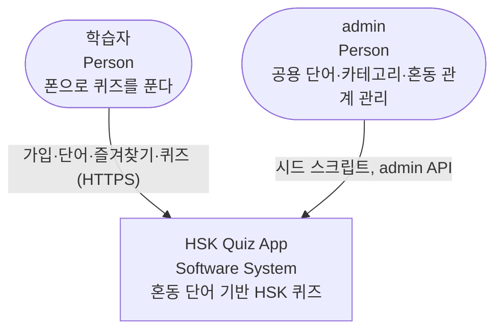
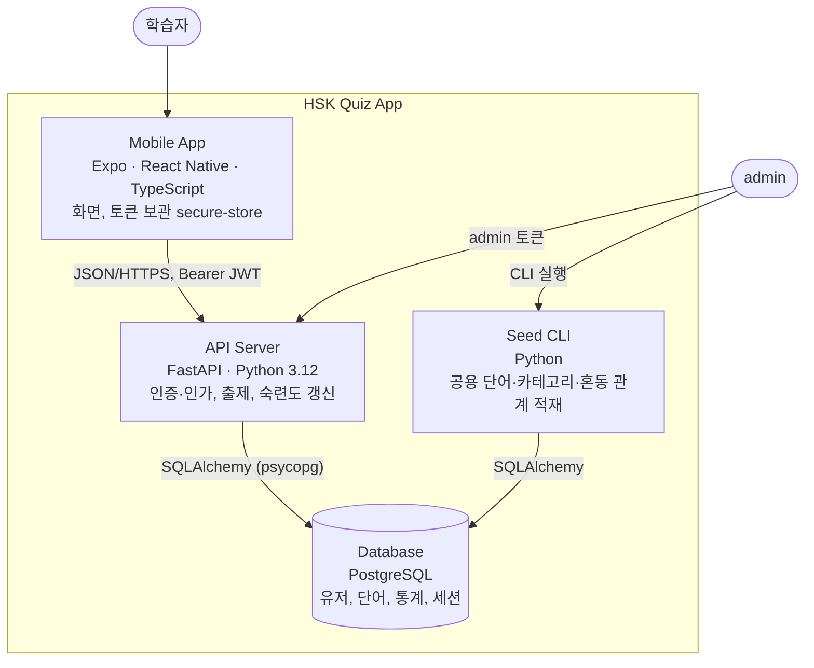

# C4 — HSK Quiz App

- 버전: v0 (2026-09-17). L1·L2만 유지한다. 코드 수준 구조는 [arc42 5.2](arc42.md#52-레벨-2--백엔드-계층).

## L1 System Context

## L2 Container

| 컨테이너 | 기술 | 위치 | 책임 |
|---|---|---|---|
| Mobile App | Expo, TypeScript | `mobile/` | 화면, API 호출, 토큰 저장 |
| API Server | FastAPI, uv | `backend/app/` | 인증·인가, 단어·즐겨찾기, 출제·채점 |
| Seed CLI | Python | `backend/app/infrastructure/seed/` | 공용 데이터 적재(여러 번 실행해도 결과 같음) |
| Database | PostgreSQL 15+ | 개발 PC에 직접 설치 | 영속 데이터, 제약 |
