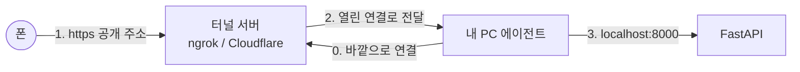

# ngrok과 터널이 하는 일

## 핵심 개념
- 내 PC에서 띄운 서버(`http://localhost:8000`)는 **집 공유기 안쪽 주소**라서 바깥 인터넷에서는 찾아올 수 없다. 공유기가 NAT로 가려 주기 때문이다.
- **터널 서비스**(ngrok, Cloudflare Tunnel 등)는 이 문제를 반대 방향 연결로 푼다.
  1. 내 PC에서 실행한 작은 프로그램(에이전트)이 **밖으로** 터널 서버에 연결을 건다(나가는 연결은 공유기가 막지 않는다).
  2. 터널 서버가 공개 주소(`https://랜덤.trycloudflare.com`, `https://…exp.direct`)를 하나 준다.
  3. 폰이 그 공개 주소로 요청하면, 터널 서버가 **이미 열려 있는 연결을 타고** 내 PC로 전달한다.
- 그래서 포트 포워딩이나 고정 IP 없이도 폰에서 내 PC의 서버를 쓸 수 있다.



## 이 프로젝트 적용
| 무엇 | 터널 | 비고 |
|---|---|---|
| 앱 화면(Metro 8081/8082) | ngrok (`@expo/ngrok`) | `npx expo start --tunnel --go`가 자동으로 띄운다. 주소는 `…exp.direct` |
| 백엔드 API(8000) | Cloudflare 빠른 터널 | `cloudflared tunnel --url http://localhost:8000`, 계정 불필요 |

- Expo가 쓰는 ngrok에는 **로컬 검사 API**가 있다. 백그라운드로 띄워 주소가 안 보일 때 여기서 꺼낸다.
  ```bash
  curl -s http://127.0.0.1:4040/api/tunnels   # 다른 Expo가 이미 떠 있으면 4041, 4042…
  ```
- 관련: [폰 접속 방식 리포트](../reports/2026-09-20-phone-backend-access.md), SRS-002

## 삽질 / 주의점
- **`ERR_NGROK_3200`(endpoint is offline)** = 공개 주소는 살아 있는데 뒤의 에이전트가 끊긴 것. Expo를 재시작하면 된다. Metro만 살아 있고 터널이 죽는 경우가 있다.
- Expo Go 목록에 뜨는 `http://192.168.x.x:8082`는 **LAN 주소**라서 다른 네트워크에서는 안 된다. 터널 주소(`exp://…exp.direct`)를 직접 입력해야 한다.
- 다른 프로젝트의 Expo가 8081과 ngrok 4040을 쓰고 있으면 포트가 밀린다(`--port 8082`, 검사 API는 4041).
- **보안**: 터널이 켜져 있는 동안 내 로컬 서버가 인터넷에 공개된다. 주소는 길고 무작위지만 비밀은 아니다 → 확인이 끝나면 끄고, 주소는 개인 URL로 취급해 문서·커밋에 남기지 않는다.
- 빠른 터널 주소는 **켤 때마다 바뀐다**. 앱의 `EXPO_PUBLIC_API_URL`도 그때마다 갱신해야 한다.

## 참고
- Expo CLI `--tunnel`: https://docs.expo.dev/more/expo-cli/
- TryCloudflare(빠른 터널): https://developers.cloudflare.com/cloudflare-one/connections/connect-networks/do-more-with-tunnels/trycloudflare/
