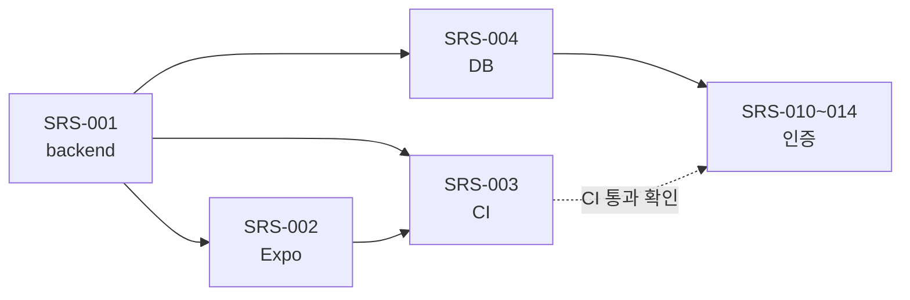

# 리포트: 프로젝트 부트스트랩과 첫 이슈(스캐폴딩·CI) 진행 계획

- 작성: 2026-09-17
- 상태: 제안
- 관련: SRS-001, SRS-002, SRS-003, SRS-004, NB-016, NB-017

## 1. 요약
- 요구사항(NB 18 · PRD 10 · SRS 21+5 planned), 아키텍처(ADR 4, arc42, C4), UX, 작업 규칙(CLAUDE.md, 스킬 5종, Stop 훅), GitHub 템플릿을 만들었다.
- 다음 순서: **SRS-001 백엔드 스캐폴딩 → SRS-002 Expo 스캐폴딩 → SRS-003 CI → SRS-004 DB**. 각각 이슈 1개 = PR 1개이며, 끝날 때마다 확인 방법을 함께 보고한다.
- 사용자가 결정할 일: HSK 기준(NB-016, SRS-020 전까지), 폰에서 백엔드에 접속하는 방식(NB-017, SRS-002에서), PostgreSQL 설치(SRS-004 전).

## 2. 부트스트랩 현황
| 항목 | 상태 | 비고 |
|---|---|---|
| 로컬 git, 초기 커밋 | 완료 | 빈 저장소라 **초기 커밋 1개만 main에 직접** 넣음(부트스트랩 예외). 이후 모두 브랜치 → PR |
| 요구사항 문서 | 완료 | `docs/requirements/` |
| 아키텍처·UX 문서 | 완료 | ADR 0001~0004 상태는 `제안`, 사용자가 머지하면 `승인`으로 바꿈 |
| CLAUDE.md, `.claude/`, `.github/` 템플릿 | 완료 | 🔴 PR, 사용자 머지 |
| GitHub 저장소(Public) | 결과 보고 참고 | 공개 저장소 생성은 사용자 확인이 필요한 작업 |
| secret scanning, push protection | 저장소 생성 후 | Public 저장소는 무료로 사용 가능 |
| 라벨·마일스톤·이슈 | 저장소 생성 후 | M0 4개, M1 17개 이슈 |
| gh 토큰 scope | 확인 완료 | `repo`, `workflow` 있음 → 추가 작업 없음 |

## 3. 계획

### 3.1 SRS-001 백엔드 스캐폴딩 (🟡 의존성 추가)
| 단계 | 내용 |
|---|---|
| 1 | `uv init backend --app` 후 `uv add "fastapi[standard]"`, `uv add --dev pytest ruff` (버전은 착수 때 공식 문서 확인) |
| 2 | `app/main.py` + `app/{domain,application,interface,infrastructure}/__init__.py`, `interface/routers/health.py` |
| 3 | `tests/test_health.py` (`TestClient`) |
| 4 | `pyproject.toml`에 ruff 설정 |

- 확인 방법(사용자)
  ```bash
  cd backend
  uv run fastapi dev app/main.py
  # 다른 터미널
  curl http://127.0.0.1:8000/health      # {"status":"ok"}
  uv run pytest
  ```
- 아직 필요 없는 패턴: Repository·Strategy·Factory 모두 불필요(DB·출제 로직 없음). 폴더만 만든다.

### 3.2 SRS-002 Expo 스캐폴딩 (🟡 앱 화면·의존성)
| 단계 | 내용 |
|---|---|
| 1 | `npx create-expo-app@latest mobile` (템플릿·SDK 버전은 착수 때 Expo 문서 확인, 템플릿에 딸린 불필요한 예제는 정리) |
| 2 | 첫 화면에서 `EXPO_PUBLIC_API_URL/health` 호출 → `서버 상태: ok` / `서버에 연결할 수 없음` |
| 3 | 폰 → PC 백엔드 접속 방식 확인(아래 비교) |

폰에서 접속하는 방식(확인 필요, SRS-002에서 실제로 시험):
| 방식 | 조건 | 장점 | 단점 |
|---|---|---|---|
| 같은 Wi‑Fi LAN IP | `--host 0.0.0.0`, Windows 방화벽 허용 | 추가 도구 없음 | 집 밖에서는 안 됨 |
| HTTPS 터널(예: Cloudflare Tunnel, ngrok) | 도구 설치, 서비스에 따라 계정 필요 | 어디서나 폰으로 확인 | 🔴 외부 서비스 사용이라 착수 전 질문, URL은 비밀처럼 취급(문서에 쓰지 않음) |

- `npx expo start --tunnel`은 Metro(앱 번들)만 터널링하고 **백엔드 API는 따로 열어야 한다**.

### 3.3 SRS-003 CI (🔴 자동화)
| job | 조건(paths) | 단계 |
|---|---|---|
| backend | `backend/**`, workflow 파일 | `astral-sh/setup-uv` → `uv sync` → `uv run ruff check .` → `uv run pytest` |
| mobile | `mobile/**`, workflow 파일 | `actions/setup-node`(npm 캐시) → `npm ci` → `npx tsc --noEmit` → `npx expo lint` |

- SRS-004 이후 backend job에 PostgreSQL 서비스 컨테이너 추가
- CI가 생기면 머지 등급 🟢(테스트만 추가, 동작 무변경 lint)에 "CI 통과 확인"이 붙는다
- 액션 버전은 착수 때 각 저장소 README에서 확인

### 3.4 SRS-004 DB (🟡, 사용자 작업 필요)
- 사용자: PostgreSQL 15 이상 설치(설치 명령은 착수 때 공식 문서를 확인해 안내), `hsk_quiz`, `hsk_quiz_test` DB 생성
- `.env`는 사용자 PC에만 두고, 접속 문자열은 채팅·문서에 붙여넣지 않는다

## 4. 순서와 의존 관계



## 5. loop-ready 제안
AC가 명확하고 사람이 실기기로 확인할 필요가 적은 것만 제안한다(라벨은 사용자가 요청할 때 붙임).
| 이슈 | 제안 | 이유 |
|---|---|---|
| SRS-001 | 가능 | curl·pytest로 AC 전부 자동 확인 |
| SRS-010, SRS-012 | 가능 | API + pytest만으로 확인 |
| SRS-002, SRS-013, SRS-021 | 불가 | 폰 화면 확인 필요 |
| SRS-003 | 불가 | 🔴 자동화 |
| SRS-004 | 불가 | 사용자 PostgreSQL 설치 필요 |

## 6. 결정 필요
1. **공개 저장소 생성 승인** — `dataCake-MSK/hsk-quiz-app`, Public
2. **NB-016 HSK 기준** — HSK 2.0(600단어) / HSK 3.0(약 2,200단어), 데이터 출처·라이선스. SRS-020 전까지
3. **NB-017 폰 접속 방식** — SRS-002에서 LAN 먼저 시험, 외부에서도 필요하면 터널(🔴)
4. **ADR 0001~0004 승인** — docs PR 머지로 승인 처리

## 갱신 (2026-09-18)
- 사용자 승인으로 **공개 저장소 생성 완료**: `dataCake-MSK/hsk-quiz-app`
- secret scanning·push protection **활성화됨**(Public 저장소라 무료). 저장소 설정은 merge commit만 허용 + 머지 후 브랜치 자동 삭제
- 라벨 14개, 마일스톤 2개(M0 기반 #1, M1 MVP #2), **이슈 #1~#21 등록 완료**(SRS-001~035), SRS·추적표에 번호 반영
- PR 2건 생성: [#22 문서](https://github.com/dataCake-MSK/hsk-quiz-app/pull/22) 🟡, [#23 규칙·자동화](https://github.com/dataCake-MSK/hsk-quiz-app/pull/23) 🔴 — 둘 다 사용자 머지 대기
- 6절 결정 필요 1번(공개 저장소 생성)은 **완료**. 2·3·4번은 그대로 남음
- CLAUDE.md에 규칙 2개 추가(사용자 요청): 작업 후 변경 파일 요약 보고, 개발 서버를 오래 켜두면 계속 켤지 질문

## 참고
- FastAPI 보안 튜토리얼(PyJWT, pwdlib Argon2): https://fastapi.tiangolo.com/tutorial/security/oauth2-jwt/
- GitHub secret scanning: https://docs.github.com/en/code-security/secret-scanning/introduction/about-secret-scanning
- 관리 체계 원본: 옆 저장소 `D_personal-api-app`의 개발 체계 플레이북 리포트
