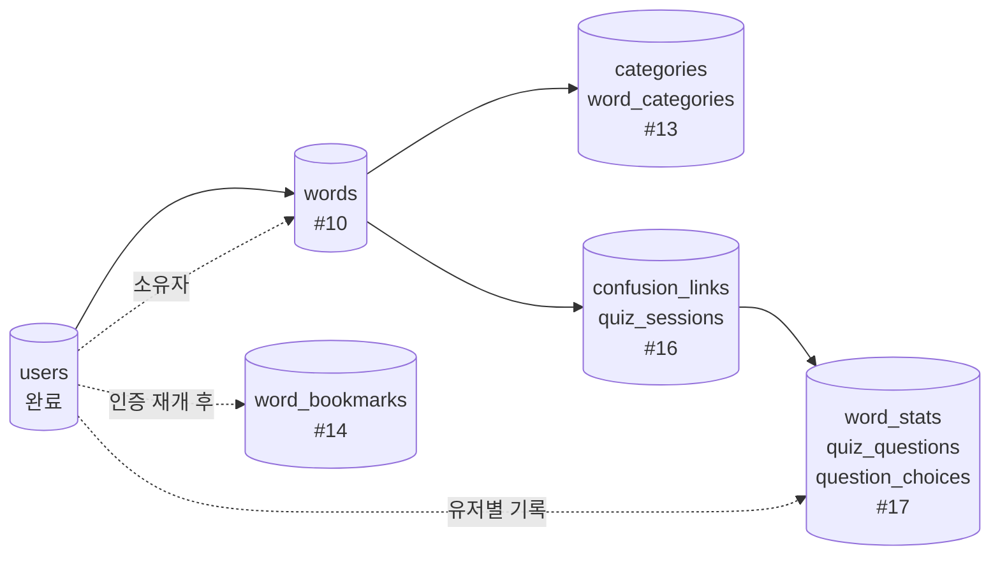

# 리포트: 현재 구현 현황과 앞으로의 구축 계획 (DB 발전 계획과 함께)

- 작성: 2026-09-24
- 상태: 확정(진행 기준)
- 관련: NB-019(인증 보류), SRS 전체, ADR-0002·0003·0004

## 1. 요약
- **기반 공사(M0)는 끝났다.** 백엔드·앱·CI·DB 연결까지 동작한다. 이슈 #1~#4, #9 완료.
- **지금 DB에는 테이블이 `users` 하나뿐**이다. 기능이 늘어날 때마다 테이블을 하나씩 추가하는 방식으로 간다(마이그레이션 1건 = 이슈 1건).
- **인증은 보류**(NB-019). 그래서 다음은 **단어 기능**이고, 인증이 필요한 기능(즐겨찾기·숙련도·세션 소유)은 인증 재개 뒤로 미룬다.
- 앞으로의 순서: **단어 → 혼동 관계·퀴즈(비로그인 임시) → 인증 재개 → 유저별 데이터 연결 → 패턴 리팩토링**.

## 2. 지금까지 만든 것

### 2.1 기능
| 영역 | 상태 | 내용 |
|---|---|---|
| 백엔드 | 동작 | FastAPI, 4계층 폴더, `GET /health`(DB 상태 포함) |
| 앱 | 동작 | Expo SDK 57, 첫 화면에서 서버 상태 표시, 폰(Expo Go) 확인 완료 |
| DB | 동작 | PostgreSQL 17 로컬, SQLAlchemy 2 + Alembic, `users` 테이블 |
| 보안 | 동작 | 요청 제한(slowapi), CORS, secret scanning·push protection, gitleaks·의존성 감사·CodeQL, main 브랜치 보호 |
| CI | 동작 | PR마다 backend(ruff·pytest·alembic), mobile(tsc·eslint), 보안 검사 |
| 회원가입 | **보류** | 구현·검증은 끝났지만 PR #36을 닫아 저장소에는 없음 |

### 2.2 API (현재 존재하는 것)
| 엔드포인트 | 설명 |
|---|---|
| `GET /health` | 서버와 DB 상태 (`{"status":"ok","db":"ok"}`) |

그 외 엔드포인트는 아직 없다.

### 2.3 이슈 진행
| 마일스톤 | 닫힘 | 열림 |
|---|---|---|
| M0 기반 | #1, #2, #3, #4 | — |
| M1 MVP | #9(rate limit·CORS) | #5~#8(인증, **보류**), #10~#21 |

## 3. DB 현황

### 3.1 지금 있는 테이블
```
users
  user_id       bigint      PK, generated always as identity
  email         varchar(320) UNIQUE, CHECK(email = lower(email))
  password_hash varchar(255)
  nickname      varchar(50)
  role          varchar(10)  default 'user', CHECK(role IN ('user','admin'))
  created_at    timestamptz  default now()
```
- 마이그레이션: `0001_create_users.py` 한 개.
- 인증을 보류해도 이 테이블은 **남겨 둔다**. 뒤에 나올 거의 모든 테이블이 `user_id`를 참조하기 때문이다.

### 3.2 앞으로 추가할 테이블과 순서
기능 이슈와 1:1로 붙는다. 각 단계는 앞 단계의 테이블을 참조하므로 순서가 중요하다.

| 순서 | 이슈 | 추가 테이블 | 새로 배우는 설계 요소 |
|---|---|---|---|
| 1 | #10 | `words` | 공용/개인 구분용 **nullable FK**(`owner_id`), CHECK로 급수 범위 제한 |
| 2 | #13 | `categories`, `word_categories` | **M:N 정션**과 복합 PK |
| 3 | #16 | `confusion_links`, `quiz_sessions` | **자기참조 정션**(단어↔단어), 쌍 정규화 CHECK, 상태를 가진 세션 |
| 4 | #17 | `word_stats`, `quiz_questions`, `question_choices` | **유저별 분리의 핵심**(복합 PK), 세션을 통한 **간접 소유** |
| 5 | 인증 재개 후 | `word_bookmarks` (#14) | 유저별 M:N 정션 |



### 3.3 인증 보류가 DB에 주는 영향
| 항목 | 보류 기간 동안 | 인증 재개 후 |
|---|---|---|
| `words.owner_id` | 항상 NULL(공용 단어만) | 커스텀 단어에 채움 (#12) |
| `word_stats.user_id` | 개발용 단일 값으로 채움 | 실제 로그인 유저로 |
| `quiz_sessions.user_id` | 개발용 단일 값으로 채움 | 실제 로그인 유저로 |
| `word_bookmarks` | 만들지 않음 | #14에서 추가 |

즉 **테이블 구조는 처음부터 유저별 분리를 전제로 만들고**, 값만 임시로 채운다. 나중에 인증이 붙어도 스키마를 갈아엎지 않아도 된다.

## 4. 앞으로의 구축 계획

### 4.1 단계별
| 단계 | 이슈 | 만드는 것 | 끝나면 눈으로 확인하는 것 |
|---|---|---|---|
| **A. 단어 데이터** | #10 | `words` 테이블, 샘플 20단어 시드, `GET /words?hsk_level=` | curl로 1급 단어 목록이 나온다 |
| **B. 단어 화면** | #11 | 앱 목록·상세 화면 | 폰에서 급수 탭을 누르면 단어가 보이고, 누르면 병음·뜻·예문이 나온다 |
| **C. 분류** | #13 | `categories`, `word_categories`, 카테고리 필터 | 폰에서 "여행" 카테고리만 골라 본다 |
| **D. 퀴즈 기반** | #16 | `confusion_links` 시드, `quiz_sessions`, 세션 시작 API | 앱에서 `퀴즈 시작`을 누르면 세션이 생긴다 |
| **E. 출제·채점** | #17, #18, #19 | 문제 생성(혼동 단어 보기), 답변 제출, 숙련도 갱신, 결과 | **폰에서 10문제를 풀고 결과를 본다 — 제품의 핵심** |
| **F. 인증 재개** | #5~#8 | 직접 구현 vs 외부 서비스 결정 후 가입·로그인 | 폰에서 가입·로그인하고 앱을 껐다 켜도 유지 |
| **G. 유저별 연결** | #12, #14 | 커스텀 단어, 즐겨찾기 | 계정 2개로 서로 안 보이는 것을 확인 |
| **H. 패턴 리팩토링** | #15, #20, #21 | Repository → Strategy → Factory | 동작은 그대로, 테스트가 계속 통과 |

### 4.2 왜 이 순서인가
1. **눈에 보이는 것이 빨리 나온다.** A~E만 끝나도 "혼동 단어 퀴즈"라는 제품의 핵심을 폰에서 직접 써볼 수 있다.
2. **DB를 아래에서 위로 쌓는다.** 단어가 있어야 혼동 관계가 있고, 혼동 관계가 있어야 출제가 된다.
3. **패턴은 마지막이 아니라 "필요해진 순간"에 넣는다**(ADR-0003). 예를 들어 Strategy는 출제 방식이 2개가 되는 #20에서 도입한다.
4. 인증은 보류했지만 **스키마는 유저별 분리를 전제로 유지**하므로, 나중에 붙일 때 데이터 구조를 바꿀 필요가 없다.

### 4.3 보류 기간의 규칙 (인증 없이 만들 때)
- API는 토큰을 요구하지 않는다. 대신 **공용 데이터만** 다룬다.
- 유저별 값이 필요한 테이블(`word_stats`, `quiz_sessions`)은 개발용 단일 유저 값을 쓰고, **그 자리를 코드에 `TODO(NB-019)`로 표시**해 인증 재개 때 빠짐없이 바꾼다.
- 인증이 필요한 기능(#12 커스텀 단어, #14 즐겨찾기)은 만들지 않는다.
- 인증을 재개할 때 "토큰 없으면 401", "남의 리소스는 404" 테스트를 한 번에 추가한다.

## 5. 결정 필요
1. **HSK 기준(NB-016)** — #10에서 시드를 넣기 전에 정해야 한다. 정해지지 않으면 **개발용 샘플 20단어**로 진행하고 나중에 교체한다(권장).
2. **인증 방식(NB-019)** — E단계가 끝나 제품을 써본 뒤 결정. 그때 직접 구현 / Clerk·Auth0·Supabase Auth 비교 리포트를 쓴다.

## 참고
- 요구사항: [SRS](../requirements/SRS.md) · [추적표](../requirements/traceability.md)
- 스키마 전체 그림: [arc42 5.3 ERD](../architecture/arc42.md#53-데이터-모델-원안--보강)
- 보안 기준: [보안 리포트](2026-09-20-security-baseline.md)
