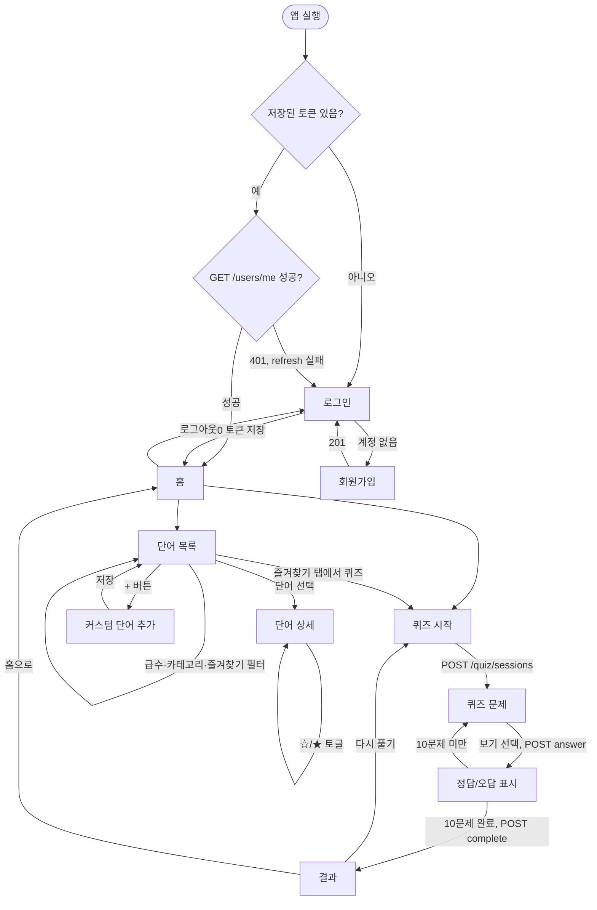
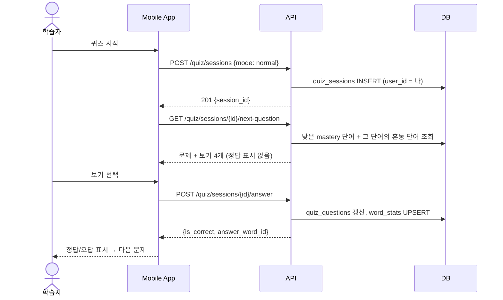

# User Flow — HSK Quiz App (MVP)

- 버전: v0 (2026-09-17). 화면 이름(login, word-list 등)은 [wireframes/](wireframes/)의 제목과 같다.

## 전체 흐름

## 퀴즈 1문제의 흐름 (앱 ↔ API)

## 시나리오별 확인 경로
| 시나리오 | 화면 순서 | SRS |
|---|---|---|
| 가입·로그인 | login → register → login → home | SRS-013 |
| 단어 보기 | home → word-list(급수 탭) → word-detail | SRS-021 |
| 커스텀 단어 | word-list → 추가 → word-list | SRS-022 |
| 즐겨찾기 | word-detail ☆ → word-list 즐겨찾기 탭 | SRS-024 |
| 일반 퀴즈 | home → quiz ×10 → result | SRS-030~033 |
| 즐겨찾기 퀴즈 | word-list 즐겨찾기 탭 → quiz → result | SRS-034 |
